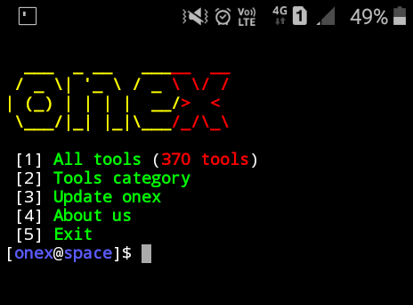

# Onex v0.2

***"Onex a hacking tools library, a better version of ToolX"***

**This is the stable branch, which means that this version of onex will have less features and less bugs/errors**

Onex is a pentesting tools installer for termux and linux distros made for cybersecurity experts.
Onex manages more than 410+ pentesting tools that can be installed on single click

<br>
<p align="center">


</p>

# Disclaimer

WE ARE NOT RESPONSIBLE FOR ANY MISUSE CAUSED BY THIS TOOL.

Any actions and or activities related to Onex is solely your responsibility. 
The contributors will not be held responsible in the event any criminal charges be brought against any individuals misusing this toolkit to break the law.\
This tool is made for educational purposes only!!

-----------------------------------------------------------------------

## Small demo


------------------------------------------------------------------------

## Operating System Requirements

Onex works on any of the following operating systems:
- **Android** (Using the Termux App)
- **Linux** (Ubuntu, Kali, Fedora)
- **Mac** (Should work)

------------------------------------------------------------------------

### Dependencies
Onex requieres following packages to run properly:
* `curl`
* `git`

------------------------------------------------------------------------

## How to install onex?

Open the terminal and type following commands.
First of all, make sure that you have `git` installed

* ```git clone -b stable --single-branch https://github.com/1ray-1/onex.git```

Go to this directory and run onex
* `cd onex`
* `bash onex`

**If you want to install onex , type the following:**
* `chmod +x install && ./install`

**Before installing, make sure that the base folder is just called `onex`, and not `onex-stable`, or `onex-old`, etc...
This is for the `install` script, which is instructed to move the `onex` to a specific directory**

------------------------------------------------------------------------

## How to use onex ?

Onex is very simple and easy to use tool, its available in both CLI and manual mode.

### CLI Mode :
`onex -h` or `onex help` for help.

Options :
- `onex install/-s [tool_name]` install any tool.
- `onex install/-s [tool_name1] [tool_name2] [etc..]` install multiple tools (buggy)
- `onex search/-s [tool_name]` search any tool.
- `onex list/-l` list all tools.
- `onex help/-h` get help.

### Menu Mode :

`onex start` to start onex menu mode.

Enter a Number for a specific output:
- (1) : To show all available tools and type the number of a tool which you want to install.
- (2) : To show tools category.
- (3) : If you want to update onex.
- (4) : If you want to know About Us.
- (5) : To exit the tool.

------------------------------------------------------------------------

### How to remove ?

Type `onex -r` or `onex remove` to uninstall onex (maybe you'll have to enter sudo password).

------------------------------------------------------------------------

## Found a Bug ?
Tell about your problem in [issue](https://github.com/1RaY-1/onex/issues) and we'll try to help you.

-----------------------------------------------------------------------

## About contribution
I would happy if you could add a cool feature or any bugs solution for onex to improve it.

---------------------------------------------------------------------

## ToDo
 * Add option **Install all tools**
 * Support Arch Linux
 * Program install script to rename any `onex-*whateverHERE*` folder to just `onex` before installing it
 * Add more tools

------------------------------------------------------------------------

## License
Onex is licensed under [MIT](https://github.com/1RaY-1/onex/blob/main/LICENSE) License.
